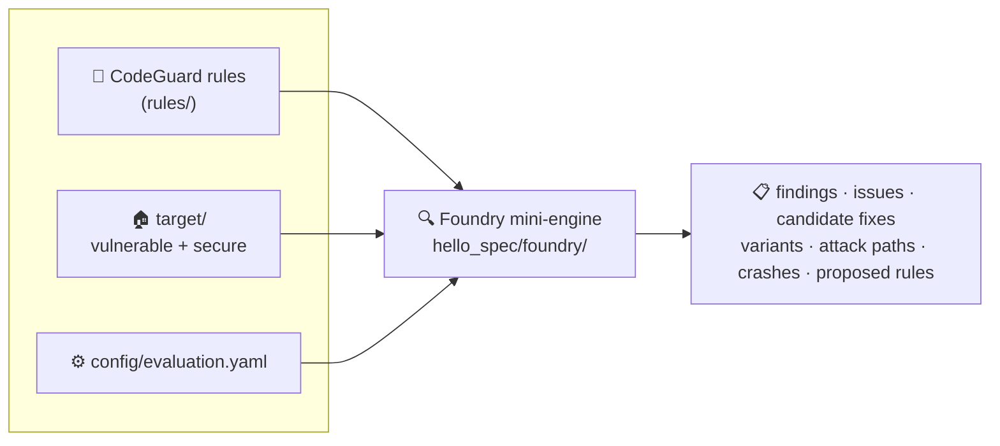
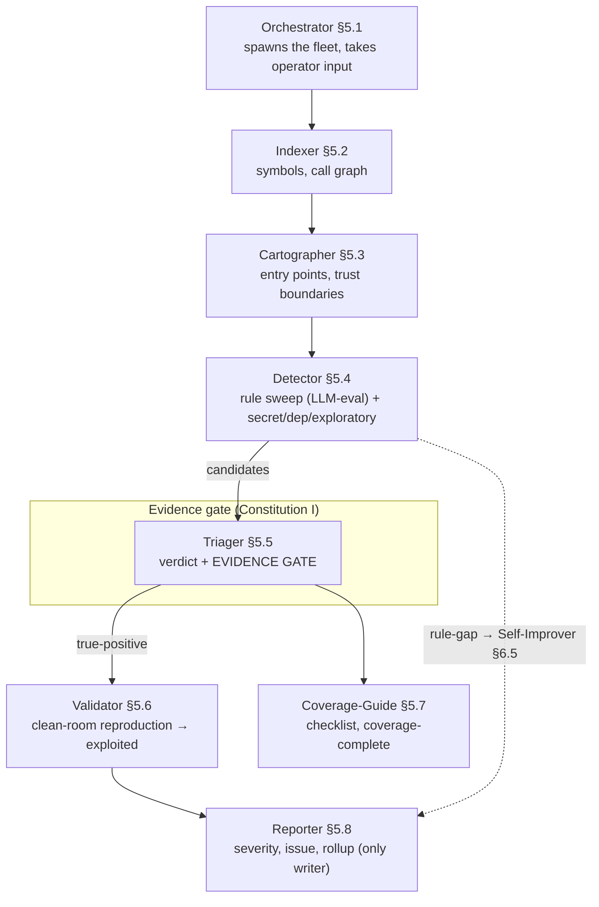
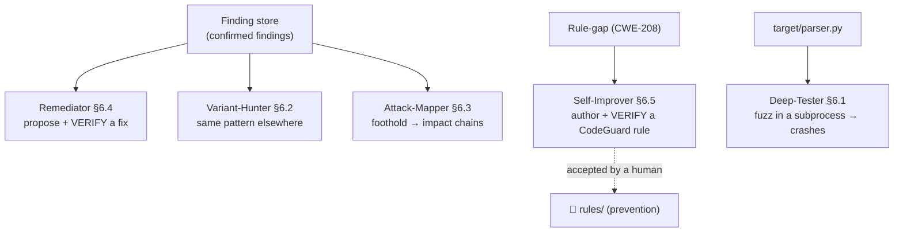
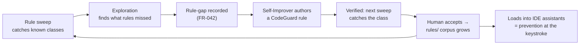
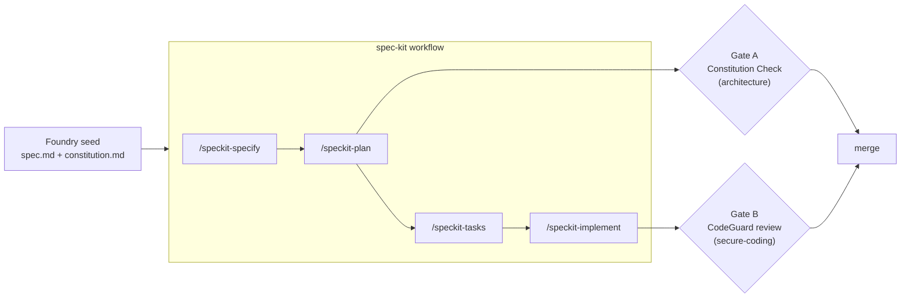

# Architecture

Diagrams of how hello-spec works. They render on GitHub. For the plain-language
version, see the [visual explainer](visual/index.html); for the spec/process
layering, see [`METHODOLOGY.md`](METHODOLOGY.md); for the file-by-file map, see
[`ELEMENT-MAP.md`](ELEMENT-MAP.md).

## The big picture

## The evaluation pipeline (the 8 core roles, §5)

The Triager is the heart: a finding is only `true-positive` if its reachability,
trust-boundary and impact citations **mechanically resolve** against the index —
the model reasons, the architecture decides.

## The extension roles (§6) — all implemented

## The detection → prevention flywheel (Foundry's centrepiece)

## How it's built — the two-gate spec-driven process

See [`METHODOLOGY.md`](METHODOLOGY.md) for what each gate checks and why CodeGuard
wears two hats (the Detector's rule corpus *and* the secure-coding gate).
